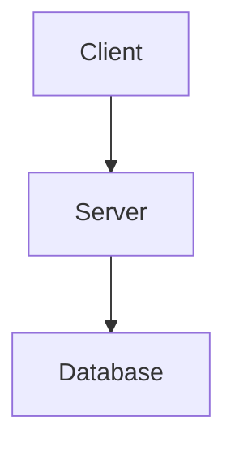

# Website Documentation Agent Configuration

This directory contains the project website built with **VuePress 2** (Vite bundler). Every page is rendered from Markdown under `website/src/`. This file defines conventions for creating and updating website documentation.

## Quick Reference

- **Framework**: VuePress 2 with `@vuepress/bundler-vite`
- **Source root**: `website/src/`
- **Local dev**: `npm run docs:dev`
- **Build**: `npm run docs:build`
- **Preview (Docker)**: `npm run docs:preview`

## Local Development

Start the dev server from the `website/` directory:

```bash
cd website/
npm run docs:dev       # Hot-reload dev server
npm run docs:build     # Production build (output in .vuepress/dist/)
npm run docs:preview   # Serve build output via Docker + nginx at http://localhost:8080/obsidian-headless/
npm run docs:preview:stop  # Stop the Docker preview container
```

## Frontmatter

Every page MUST have YAML frontmatter with at minimum a `title` field:

```markdown
---
title: Page Title
---
```

The home page (`src/README.md`) uses extended frontmatter (`home: true`, `heroImage`, `heroText`, `actions`, `features`). For all other pages, use the minimal `title` field unless a specific VuePress plugin requires additional keys.

Do NOT invent new frontmatter fields. Use only what existing pages use or what VuePress / theme docs specify.

## Section Pages (directory index pages)

Directories that serve as section indexes MUST provide a `README.md` with a brief overview and links to subpages. Example:

```markdown
---
title: Installation
---

# Installation

Choose your platform:

- [macOS](macos.md)
- [Linux](linux.md)
- [Docker](docker.md)
```

If a directory has only one file, consider flattening it unless a second subpage is expected soon.

## Directory Structure

| Directory | Audience | Content |
|-----------|----------|---------|
| `src/` | All | Home page landing |
| `src/getting-started.md` | New users | Quick-start guide |
| `src/installation/` | New users | Platform-specific install guides |
| `src/usage/` | Users | How-to guides for sync, publish, configuration, auth |
| `src/cli-reference/` | Users + devs | Full CLI command reference |
| `src/architecture/` | Developers | Internal architecture deep-dives |
| `src/assets/` | — | Static assets (images, logos) |

## When to Create a New Page vs. Update an Existing One

| Scenario | Action |
|----------|--------|
| New major feature or subsystem | Create new subpage under the appropriate directory (e.g., `architecture/new-feature.md`) |
| Minor clarification, bug fix, or correction | Update the existing page |
| New CLI command or flag | Update the relevant `cli-reference/` page or create one if the command group is large enough to warrant its own page |
| New install platform | Create new file under `installation/` and update `installation/README.md` index |
| New usage workflow | Create new file under `usage/` and update `usage/README.md` index |

Always update the parent `README.md` when adding subpages so the section index stays current.

## Callouts

Use VuePress container callouts. Do NOT use raw HTML for callouts:

```markdown
::: tip
Optional enhancement or best practice.
:::

::: info
Neutral supplementary information.
:::

::: warning
Important notice — users should pay attention.
:::

::: danger
Critical warning — potential data loss, security risk, or breaking change.
:::
```

Callout titles are optional. If provided, place them on the same line as the opening fence (e.g., `::: warning ⚠️ Data Loss Risk`).

## Diagrams

Use Mermaid code blocks for ALL diagrams. Do NOT use ASCII art or plain-text diagrams:

````markdown

````

Supported diagram types: `graph TD`, `graph LR`, `sequenceDiagram`, `flowchart TD`, `stateDiagram-v2`.

Ensure Mermaid syntax is valid. The site includes `mermaid` as a dependency, so diagrams render automatically.

## Code Blocks

Always specify a language marker:

````markdown
```bash
ob sync-run --continuous
```

```go
client := api.NewClient(token)
```

```json
{
  "vault_id": "abc123",
  "sync_mode": "push"
}
```
````

For shell commands, use `bash` (not `sh`). For Go source, use `go`.

## Tables

Use Markdown tables for configuration settings, CLI flags, and parameter reference:

```markdown
| Flag | Type | Default | Description |
|------|------|---------|-------------|
| `--continuous` | `bool` | `false` | Run in continuous mode |
| `--vault` | `string` | — | Vault ID or name |
```

- Use `—` for required fields with no default.
- Use `false`, `0`, `"string"` etc. for actual defaults.
- Keep descriptions concise (one line where possible).

## Style

- **Lead with the "what"**, then explain the "why" or "how".
- **Keep paragraphs short** (3-4 sentences max).
- **Use active voice** ("The engine scans files" not "Files are scanned").
- **No marketing fluff** — this is technical documentation.
- **Cross-reference** related pages with relative links (e.g., `[Sync Protocol](./sync-protocol.md)`).
- **Use relative links** for intra-site navigation. Use absolute paths (`/usage/`) for top-level sections from the home page.

## Dual Audience

The website serves two audiences:

1. **Developers** — looking for architecture internals, protocol details, and implementation notes. These readers go to `architecture/`.
2. **Advanced users** — looking for configuration reference, CLI commands, and operational guidance. These readers go to `usage/`, `cli-reference/`, and `installation/`.

When writing, state the audience implicitly through content depth. Architecture pages assume familiarity with Go and distributed systems. Usage pages assume the reader has the CLI installed and wants to get work done.

## Sync with `docs/`

The repo root `docs/` directory contains plain Markdown architecture documents. These are the source of truth for deep technical content. The `website/src/architecture/` pages should **mirror or complement** their `docs/` counterparts:

| `docs/` | `website/src/architecture/` | Relationship |
|---------|-----------------------------|--------------|
| `docs/architecture.md` | `website/src/architecture/README.md` | High-level overview; website version is a curated subset with diagrams |
| `docs/sync-protocol.md` | `website/src/architecture/sync-protocol.md` | Website page may reference and summarize the full `docs/` version |
| `docs/encryption-protocol.md` | `website/src/architecture/encryption.md` | Same — website version targets advanced users, `docs/` is exhaustive |
| `docs/rest-api.md` | `website/src/architecture/rest-api.md` | Mirrors API reference |
| `docs/circuit-breaker.md` | `website/src/architecture/circuit-breaker.md` | Mirrors circuit breaker docs |

**Rules:**

- If content in `docs/` changes, check whether the corresponding `website/` page needs updating.
- `docs/` is the canonical source for protocol-level detail.
- `website/` pages are curated, more readable, and include diagrams/tables for quick reference.
- Do NOT duplicate large blocks of identical text between `docs/` and `website/`. Link or summarize instead.
