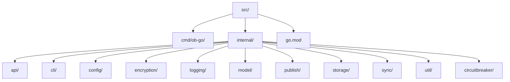
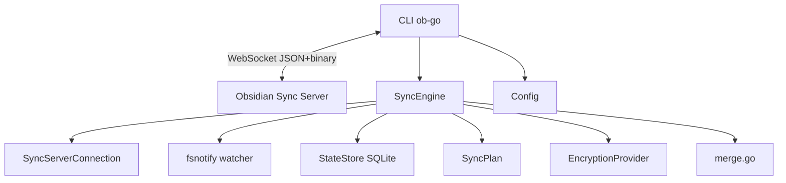
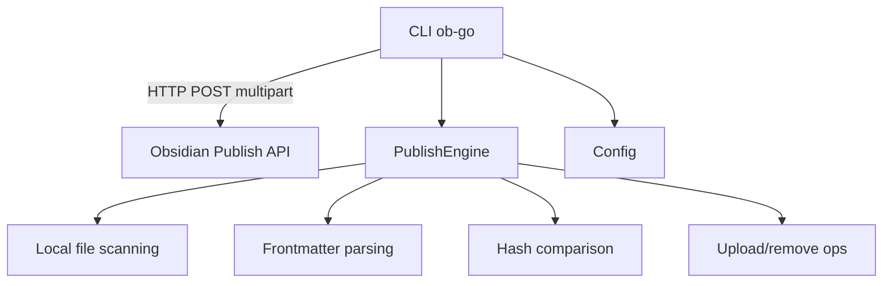
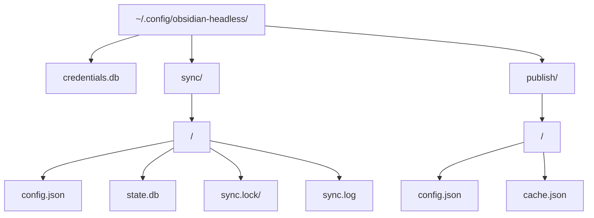

# Architecture

This page provides a high-level overview of how the Headless Go client for Obsidian is structured, how data moves through the system, and where configuration lives.

For deeper dives into specific areas, see the [architecture subpages](#further-reading).

## Module Layout

The source code lives under `src/` and is split into focused packages:

| Package | Key Files | Purpose |
|---------|-----------|---------|
| `api` | `client.go` | HTTP REST client for Obsidian cloud services |
| `circuitbreaker` | `config.go` | Circuit breaker factory functions and error types |
| `cli` | `root.go`, `sync.go` | Cobra CLI entry point and command tree |
| `config` | `config.go`, `secrets.go` | Configuration management (auth, sync, publish) |
| `encryption` | `provider.go` | EncryptionProvider interface, V0 AES-GCM, V2/V3 AES-SIV + AES-GCM |
| `logging` | `logger.go` | zerolog console + file logger with lumberjack rotation |
| `model` | `types.go` | Shared types (UserInfo, Vault, SyncConfig, FileRecord, etc.) |
| `publish` | `engine.go` | Publish scanning, upload, and removal engine |
| `storage` | `state.go`, `crypto.go` | SQLite state store via modernc.org/sqlite, credential encryption |
| `sync` | `engine.go`, `connection.go`, `plan.go`, `merge.go`, `lock.go` | Sync engine, WebSocket connection, plan builder, three-way merge, file locking |
| `util` | `files.go` | File scanning, SHA-256 hashing, safe path join, random hex |

## Data Flow

### Sync Flow

The sync flow keeps a local vault in sync with the Obsidian Sync server over a WebSocket connection.

RunOnce and RunContinuous share a common `runSyncCycle` method for the core sync logic (local scan, remote merge, rename detection, plan building, plan execution, state save). Over WebSocket connection: file watcher (fsnotify), remote rename detection (UID matching + hash fallback), plan builder (upload/download/delete/merge actions), parallel downloads with worker pool, three-way merge for text, JSON key-level merge for configs, 2MB chunks, 200MB max file, 30s interval, 5 concurrent downloads.

For details on the sync protocol, see [Sync Protocol](./sync-protocol.md). For encryption specifics, see [Encryption](./encryption.md).

### Publish Flow

The publish flow scans local files and uploads them to the Obsidian Publish API.

For details on the REST API used by publish (and sync), see [REST API](./rest-api.md).

## File Watching Strategy

The sync engine uses `fsnotify` (cross-platform Go file system notifications), with a periodic full-rescan for consistency. Event aggregation with debounce is used to batch rapid changes. In continuous mode, the watcher triggers sync cycles on file changes.

### Watch disabled for read-only modes

In pull-only and mirror sync modes, local file changes are never uploaded. The fsnotify watcher is not started; only an initial scan is performed. This eliminates filesystem event overhead on machines that only download.

## Configuration Storage

All configuration is stored under a platform-specific base directory:

- **Linux**: `$XDG_CONFIG_HOME/obsidian-headless` or `~/.config/obsidian-headless`
- **macOS**: `~/.obsidian-headless`

Directory structure:

- **auth token**: OS keyring (with encrypted SQLite fallback at `credentials.db`)
- **vault config**: `sync/{vaultID}/config.json` + `state.db`
- **site config**: `publish/{siteID}/config.json` + `cache.json`

## Dependencies

| Package | Purpose |
|---------|---------|
| `spf13/cobra` | CLI framework for command parsing and flag management |
| `modernc.org/sqlite` | Pure-Go SQLite driver for sync state storage |
| `gopkg.in/yaml.v3` | YAML parsing for frontmatter extraction |
| `sony/gobreaker/v2` | Circuit breaker for API and WebSocket resilience |

## Runtime Requirements

- **Go 1.21+** — Required for building the CLI binary. Uses Go 1.26 in CI.
- **Platforms**: Linux, macOS, Windows (amd64, arm64)

## Further Reading

- [Sync Protocol](./sync-protocol.md) — Deep dive into the WebSocket sync protocol
- [Encryption](./encryption.md) — Encryption providers, AES-SIV, and key derivation
- [REST API](./rest-api.md) — HTTP REST client and API endpoints
- [Circuit Breaker](./circuit-breaker.md) — Pattern overview, retry integration, and state management
